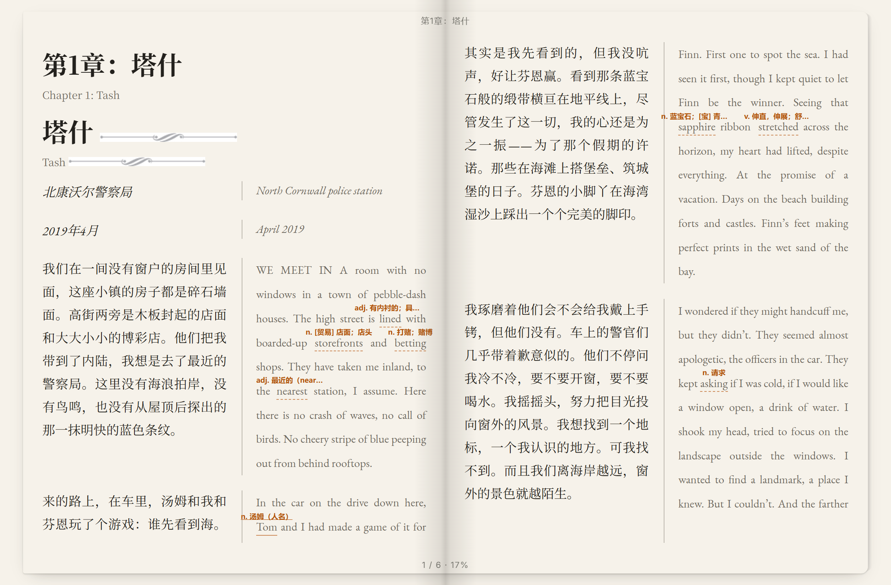
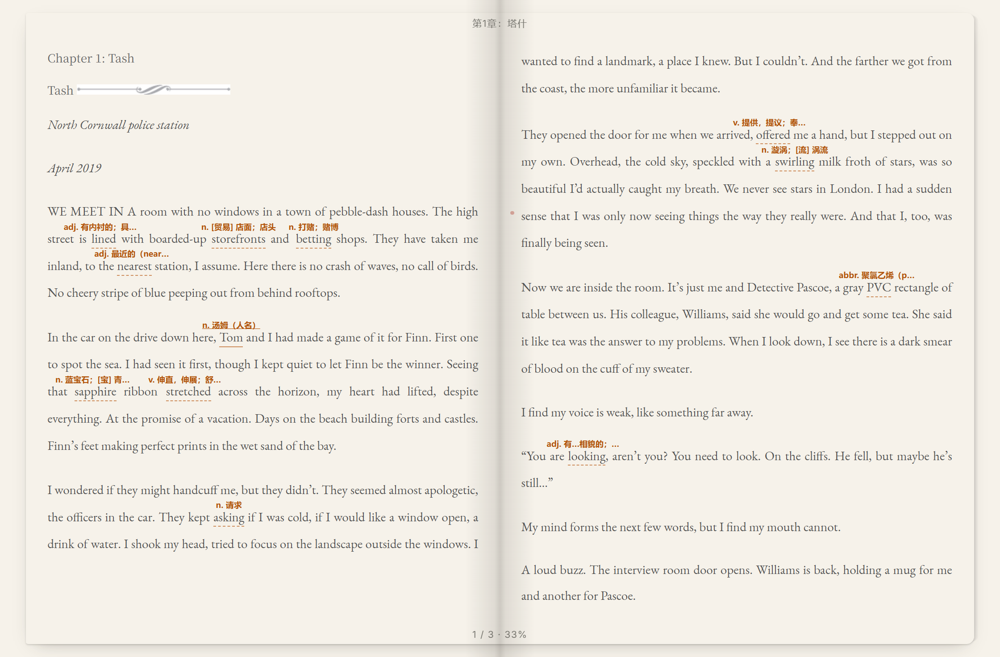
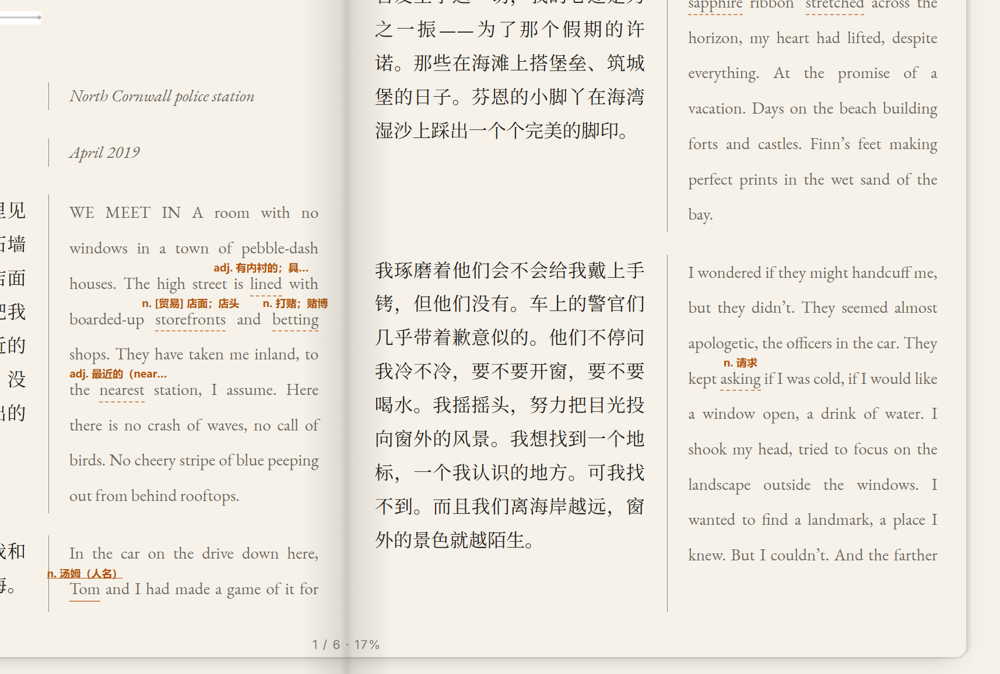
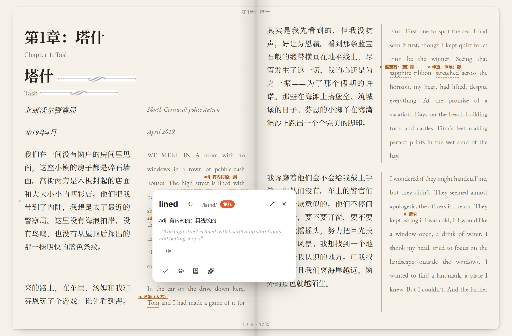
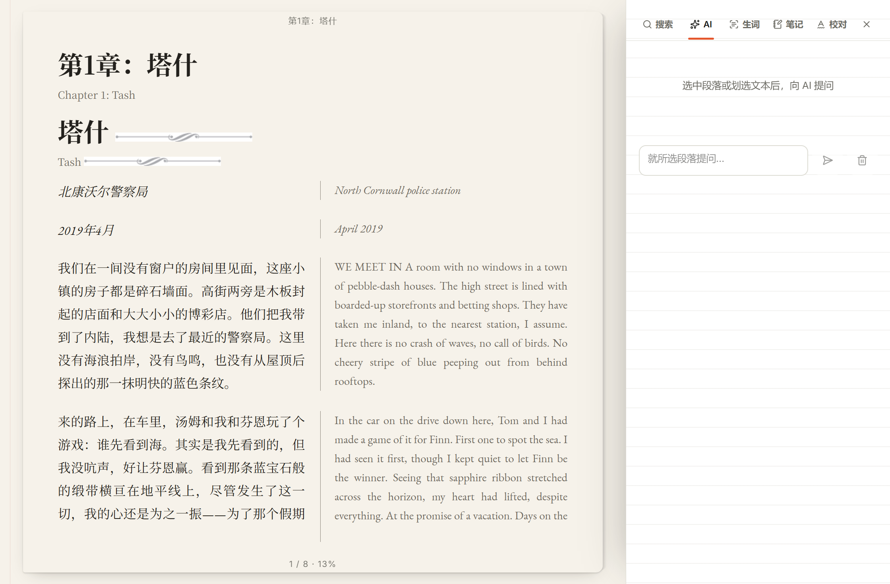
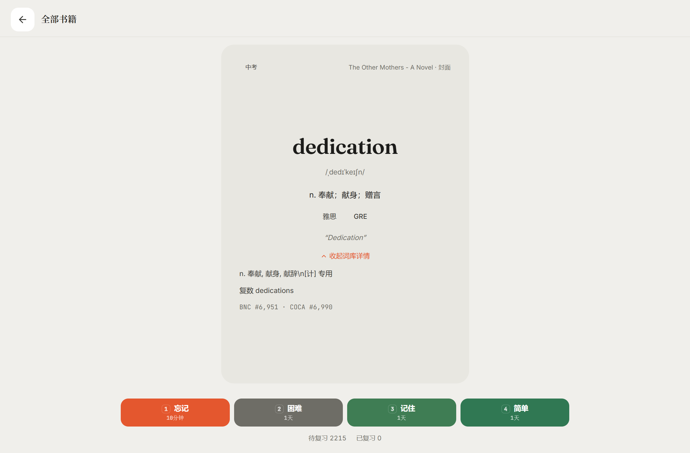
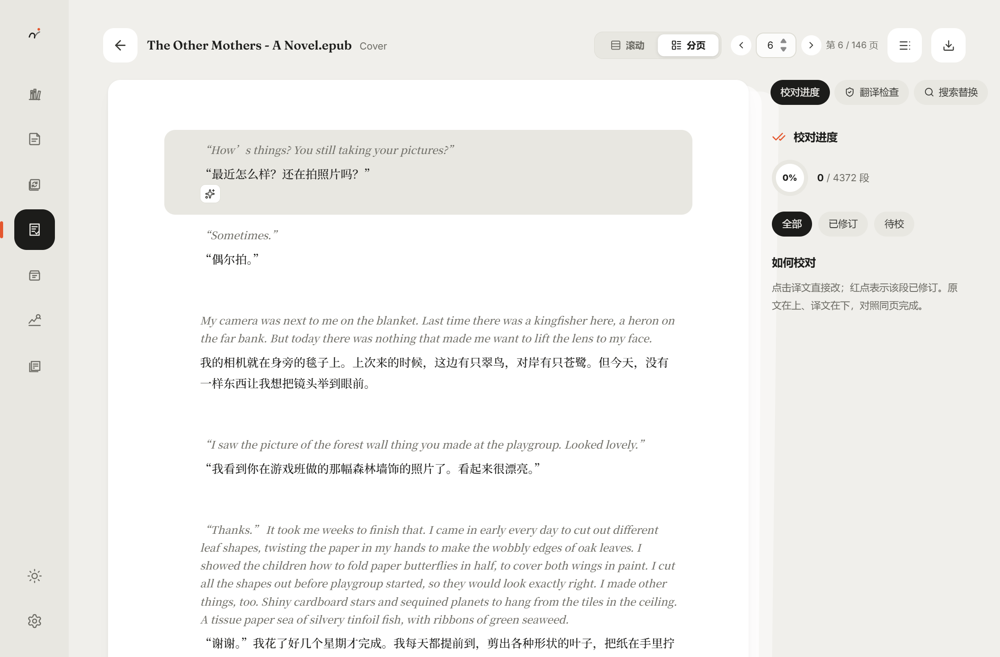
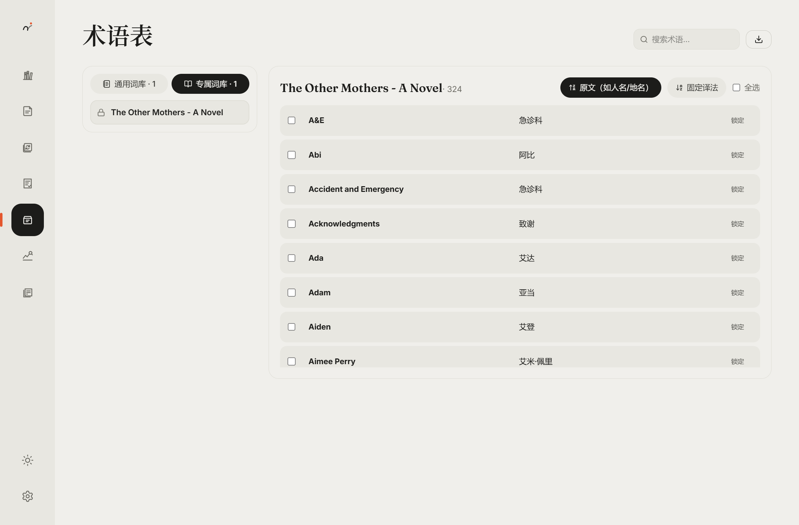
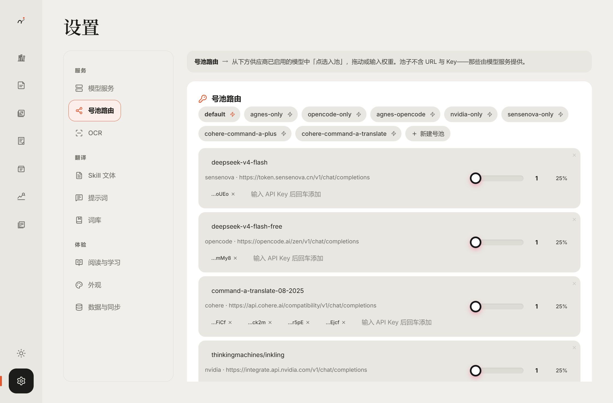
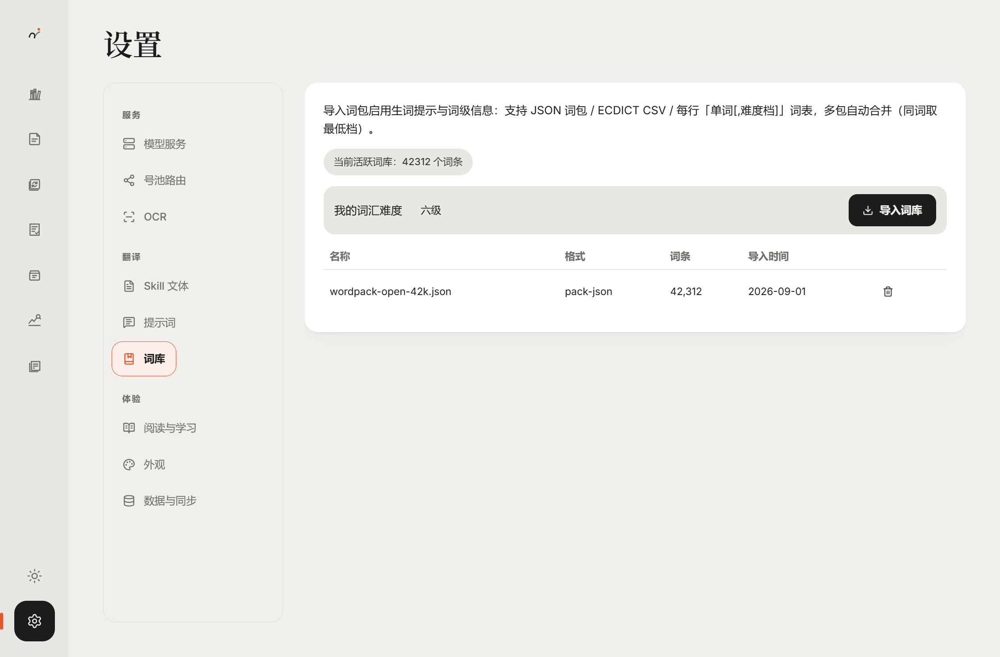

<div align="center">


# MuseReader

**Turn a whole foreign-language book into a bilingual book you can actually read.**

A local-first AI workspace for long-document translation, bilingual reading and vocabulary acquisition.
React 19 · Tauri 2 · Rust — your books, your notes and your API keys all stay on your own device.

</div>

---

Most readers assume the book is already translated. MuseReader handles the harder step before that: **give it a foreign book nobody has translated, and it translates the whole thing, lays it out as a readable bilingual book, then helps you chew through the new words one by one.** The pipeline fades into the background; what you face is always the book itself.

## Why this one

- **The whole book, not page fragments** — web translators lose context: proper nouns drift, long sentences come apart. MuseReader translates at book scale, then goes back and reconciles terms and names.
- **Translation is only the start** — what it delivers isn't a blob of text but a complete bilingual asset you can keep **reading, reviewing, looking up, memorizing and annotating**.
- **Local-first** — no account, no cloud, no telemetry. API keys live on your machine; books and progress stay on your disk, and you pack them up yourself when you switch machines.
- **No wasted spend** — a whole book can run into hundreds of thousands of tokens. MuseReader checkpoints every step, so an interruption, crash or restart resumes exactly where it stopped and never bills twice.

## The translation pipeline: strategy and edge

After import, every book runs through a pipeline designed for long documents (scanned PDFs get an OCR pre-pass first):

**chunking → parallel translation → term-consistency repair → residual-language review → layout rendering → artifact writing**

Translating page by page has three hard failure modes: **drifting names, untranslated leftovers nobody catches, and a single interruption throwing away hours of work.** Every stage below is an engineering answer to one of them:

| Stage | What it solves for you |
|---|---|
| **Smart chunking + chapter-level parallelism** | Chunks are cut on semantic boundaries and tagged by segment kind (body / references / tables); multiple workers translate one book at once with a live event stream — big books become observable incremental output, not a black-box wait |
| **Automatic glossary extraction & cross-chunk propagation** | Names, places, organizations and domain terms are extracted during translation and unified book-wide; newly confirmed terms are back-filled into already-translated chunks as wave patches — no re-translating the whole book for one word |
| **Term-consistency repair** | A whole-book re-scan detects one source name rendered as several different variants and reconciles them; pin a translation and the model won't second-guess it |
| **Residual-language review (two-tier safety net)** | ① *Whole-paragraph misses*: lines that are dense English with no Chinese are detected and reset for retranslation. ② *Word-level residue*: English words embedded in Chinese sentences (e.g. `Marlin rifle`) are collected, budgeted fairly across chunks, and repaired by a targeted LLM pass. A second pass re-measures the actual translation text and reports what truly remains |
| **Genre-aware policies** | 11 article types run their own rules: fiction/children enforce transliteration of story-world names (no leftover Latin brand words); academic/legal keep DOIs, citations and standard names, with reference sections masked from false positives |
| **Checkpointed resume + incremental retry** | Every chunk carries a persisted processing stage (translated → term-checked → reviewed → mergeable). Interruptions resume from the checkpoint; on load, polluted translations (mojibake, untranslated blocks, half-translated blocks) are invalidated automatically — a retry re-translates only the bad chunks, never the whole book |
| **Multi-key rotation pools + adaptive rate limiting** | Each route (provider × key) has its real throughput learned continuously and gets concurrency by water level; failing routes are de-weighted and 429s back off — flaky endpoints get used as stable throughput |
| **Layout rendering** | Emits a true-XHTML EPUB (translated / bilingual), preserving tables, figures, captions and TOC structure — never downgraded to plain text |
| **Auditable artifacts** | Every task persists a checkpoint, a full event stream, quality metrics and a validation report — progress, failures and residual findings are all checkable item by item |

> In short: others do "translate this passage"; MuseReader does "hand you this book — consistent throughout, nothing left untranslated, typeset properly, resumable, auditable, and ready to keep reading and learning from."

## Core capabilities

### 📖 A reader built on real book markup

Translated EPUBs render as true XHTML, not a flattened wall of text:

- **True bilingual spread** — original left, translation right, aligned paragraph by paragraph on one screen; or monolingual Chinese / English modes
- **Paging** — single page / book spread / vertical scroll, page-turn animations, volume-key paging, auto-scroll reading, and fully custom 3×3 touch zones
- **Typography console** — font size, line/paragraph/letter spacing, indents, alignment, columns, margins, separate CJK/Latin fonts with importable font files, three-slot header/footer, custom CSS, use-book-styles toggle
- **Reading themes** — light/dark base × 5 accent palettes, custom colors, background images, system-theme following, screen-brightness control
- **Active recall** — blur the translation until you hover it: re-reading quietly becomes self-testing, great after a first pass
- **Paragraph dot menu** — hover a paragraph for AI actions: summarize, sentence-by-sentence paraphrase, retranslate this paragraph, ask a question (all streaming)
- **At your fingertips** — selection translation, click-to-look-up, bookmarks, table-of-contents jumps, TTS, one-tap simplified/traditional conversion

### 🔤 WordWise in-line glossing: reading that grows your vocabulary

Set your level and it glosses only words **above it** — accurate the more you read:

- **10-tier graded system**: Junior High / Senior High / CET-4 / CET-6 / Postgraduate / IELTS / TOEFL / TEM-4 / TEM-8 / GRE
- Words you mark *learning* are always forced in; words you *mastered* drop out — it won't nag you about ones you know
- Three mark styles (dotted underline / highlight / superscript) showing a Chinese gloss or IPA, handled by a collision-avoidance algorithm to **never overlap neighboring marks**
- Click any glossed word for a dictionary card: IPA, inflection decoding, BNC/COCA corpus frequency, Collins/Oxford star ratings, roots & affixes, expandable full entry
- One tap moves a word into your study plan, pooled across books into a global queue

### 🎯 Spaced repetition that keeps the words

- **SRS decks** — per-book notebooks plus a global new-word queue; the flipped face is the full dictionary card
- **Four-grade rating** (forgot / hard / good / easy) drives interval scheduling; due cards roll into your review queue automatically
- Review ratings feed back into WordWise tiers — words you know stop nagging, words you're forgetting resurface

### 📝 Notes: keep the traces of reading

- **Paragraph notes** and **word annotations** are collected automatically, browsable in card / list dual views
- Notes share one system with bookmarks, new words and review edits — read, note, learn and proofread connect instead of fragmenting

### 📊 Insights: only from your real behavior

- Daily goals, reading heatmaps, review trends and vocabulary-tier distribution, all computed from your actual reading and review
- The UI never shows faked or placeholder data

### ✅ Review bench: polish the translation, paragraph by paragraph

- **Source / target side by side**; click the translation to edit in place, edited segments are flagged with a dot
- **Edits write back to the artifacts**, so the next export or read reflects them — not a throwaway display-layer patch
- **Review progress**, **translation check**, **search & replace**, and scroll / paged modes, so even a long book can be proofread methodically

### ⚙️ Model, glossary and data freedom

- **Three API shapes** — OpenAI-compatible / OpenAI Responses / Anthropic, with built-in presets (SenseNova, MiniMax, NVIDIA, Cohere, …) and fully custom endpoints
- Configurable OCR service (PaddleOCR-VL)
- Translation style skills, prompt templates, glossaries and word lists — all managed in Settings
- One-click ZIP backup export/import; **per-book migration bundle** (right-click export: task record + all artifacts + cover + bookmarks/notes/vocab/progress — re-import on a new machine restores everything)
- No telemetry, no cloud storage, no account

### 🌐 Interface

Instant 中文 / English switching (double-click the rail logo); keyboard shortcuts for theme and accent palettes.

## Gallery

| Library | Bilingual spread | English spread |
|---|---|---|
|  |  |  |

| WordWise glossing | Word card | AI sidebar |
|---|---|---|
|  |  |  |

| Study deck (landscape) | Insights | Review bench |
|---|---|---|
|  |  |  |

| Glossary | Settings · Key pools | Settings · Word list |
|---|---|---|
|  |  |  |

## 🎁 Open graded word pack (published separately, importable)

WordWise and the study features rely on a graded vocabulary. We compiled public sources into an **open word pack**, open-sourced as its own repository for anyone to import — **it is not embedded in the installer**; importing is entirely your choice.

**`musereader-wordpack-graded.json` — 42,312 English words across 10 tiers**

| Tier | Words | Tier | Words |
|---|---|---|---|
| Junior High | 8,272 | IELTS | 2,835 |
| Senior High | 4,763 | TOEFL | 2,428 |
| CET-4 | 7,741 | TEM-4 | 808 |
| CET-6 | 1,011 | TEM-8 | 9,661 |
| Postgraduate | 2,636 | GRE | 2,157 |

Each entry carries IPA, Chinese gloss, full ECDICT senses, inflections, Collins/Oxford flags, BNC/COCA frequency ranks and root mnemonics; multi-tier words keep the lowest tier; single file ≈ 10 MB.

- **How to import**: in MuseReader go to **Settings → Word List → Import**, pick the pack. Parsing takes under 5 seconds; in-line glossing, word cards and study tiers all switch on afterward.
- **Full entries, how it's built and its license**: see the word-pack repository → **https://github.com/3650krka/musereader-wordpack** (includes the reproducible generator and upstream attribution / CC BY-NC-SA 4.0 license terms).

## Support matrix

| Area | Status |
|---|---|
| Input formats | EPUB · PDF (incl. scanned via OCR) · DOCX · Markdown · TXT |
| Output formats | Markdown · HTML · EPUB (translated / bilingual) · glossary · TOC artifacts |
| Primary pair | English → Chinese (term-locking, consistency repair, residual review, proper-noun handling end to end); Chinese → English |
| Other pairs | Latin-script sources follow the English pipeline; Japanese → Chinese translates, but shared Hanzi make automatic residual detection unreliable — the UI says so honestly instead of pretending |
| Platform | Windows desktop (Android adaptation underway — icons and dual-platform information architecture already in place) |

## Get started

1. Download and install the package for your platform.
2. Open **Settings → Providers** and point any OpenAI-compatible endpoint at a key (or pick a built-in preset).
3. Back on the shelf, **import your first book**, choose translation and layout preferences, and start the whole-book translation.
4. For WordWise glossing and study tiers: import the open graded word pack under **Settings → Word List**.

## For developers

```bash
pnpm install          # or npm install
npm run dev           # vite front end (port 1420)
npm run tauri dev     # full desktop app (Rust toolchain required)
npm run tauri build   # release installers
```

Front-end static check: `npm run build` (tsc + vite build); back-end tests: `cargo test --lib` (in `src-tauri/`, currently **836 passing**). Demo mode `npm run dev:preview` loads UI fixtures in a plain browser for demos only; **release builds strip the fixtures automatically** — demo text and local paths never enter the installer.

## 中文 / English

[中文 README](README.md) · [English README](README.en.md)
